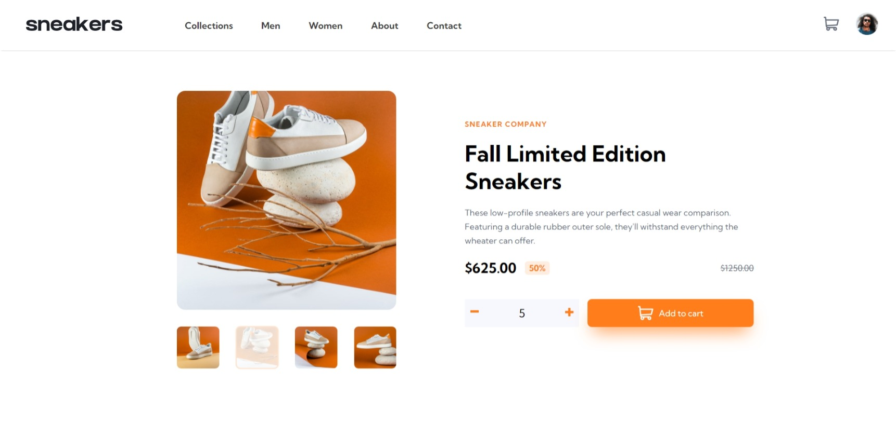
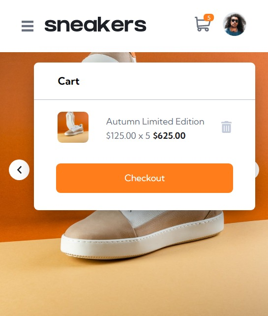

# E-commerce product page solution

Beautiful ecommerce product page with a lightbox product gallery and cart functionality

## Table of contents

- [Overview](#overview)
  - [The challenge](#the-challenge)
  - [Screenshots](#screenshots)
  - [Links](#links)
- [My process](#my-process)
  - [Built with](#built-with)
- [Author](#author)

## Overview

### The challenge

Users should be able to:

- View the optimal layout for the site depending on their device's screen size
- See hover states for all interactive elements on the page
- Open a lightbox gallery by clicking on the large product image
- Switch the large product image by clicking on the small thumbnail images
- Add items to the cart
- View the cart and remove items from it

### Screenshots

### Links

- Solution URL: [GitHub](https://github.com/JhonEduard26/ecommerce-product-page)
- Live Site URL: [GitHub Pages](https://jhoneduard26.github.io/ecommerce-product-page/)

## My process

### Built with

- Semantic HTML5 markup
- CSS custom properties
- Flexbox
- CSS Grid
- Mobile-first workflow

## Author

- Website - [Jhon Eduard Bocanegra](https://github.com/JhonEduard26)
- Frontend Mentor - [@JhonEduard26](https://www.frontendmentor.io/profile/JhonEduard26)
- Twitter - [@JhonBocanegra26](https://twitter.com/JhonBocanegra26)
